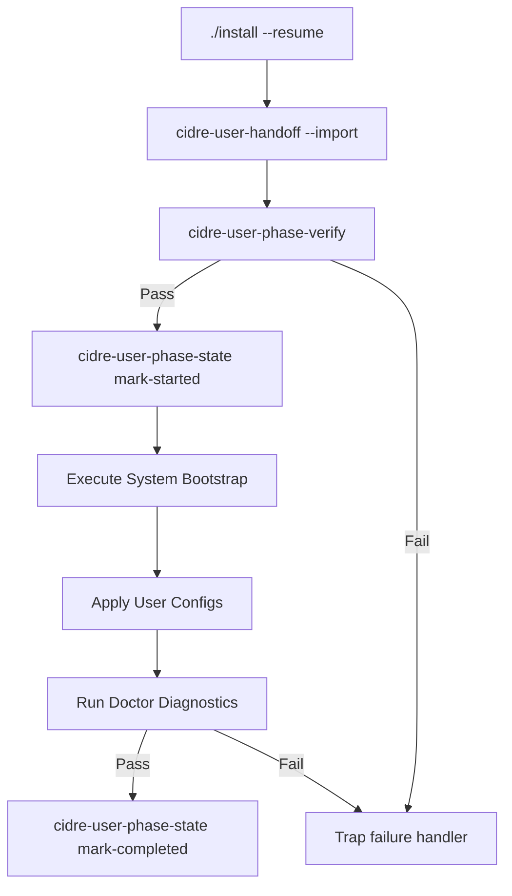

# Install Resume Validation

## Validation Constraints

When running `./install --resume`, the installer runs checks to guarantee configuration compatibility:

1. **User Identity Validation**: Asserts execution as the normal user defined in the handoff. Rejects root execution to prevent home directory configuration corruption.
2. **Resume state validation**: Asserts that `resume.env` matches `CIDRE_SEED_SCHEMA_VERSION` >= 1.
3. **Profile Validation**: Validates profile parameters againstmanifest keys.
4. **Repository Validation**: Verifies directory existence and permissions.

## Execution Sequence

## Failure Handling

If any execution step crashes, the ERR trap catches the abort signal, registers error messages using `set-error`, sets status to `failed`, and compiles a markdown execution summary.
